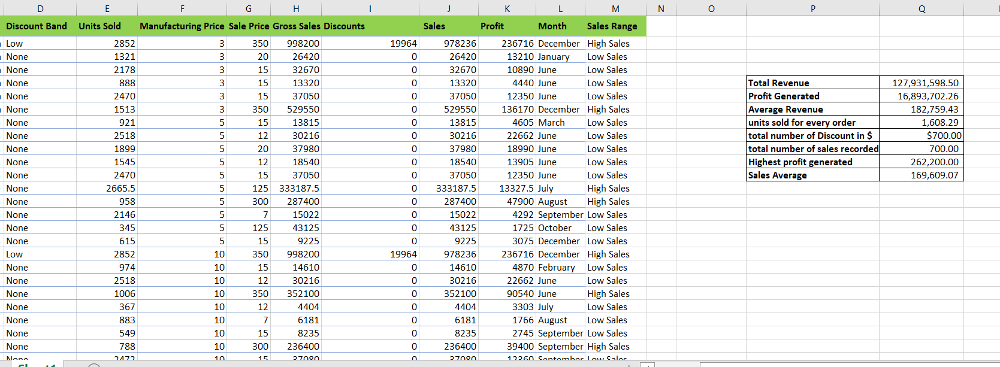

# Basic Excel Fuctions 

### Introduction:
The report presents an analysis conducted using basic Excel functions to derive insights from sales data.

### Problem Statement: 
The primary aim is to determine the following;

- Total Revenue and Profit Generated: The total revenue and profit generated were determined using the SUM function in Excel.

- Average Revenue and Units Sold per Order: Using the Average function, it's found that the average revenue and units sold per order are; $182,759.43, and 1,608.29, specifically.

- Total Number of Discounts and Total Number of Sales Recorded: These were determined using the Count function.

- Highest Profit: The highest profit value was determined using the MAX Function. 

Additionally, a new column was created and it was named ‘Sales Range’. The column was to categorize sales as 'High Sales' if their value exceeds the average, and 'Low Sales' if they fall below the average. This was determined using the IF Function. 

### Conclusion:
The report aims to identify insights in the sales data through the use of basic excel functions and below is the screenshot of the values determined from the basic questions.

